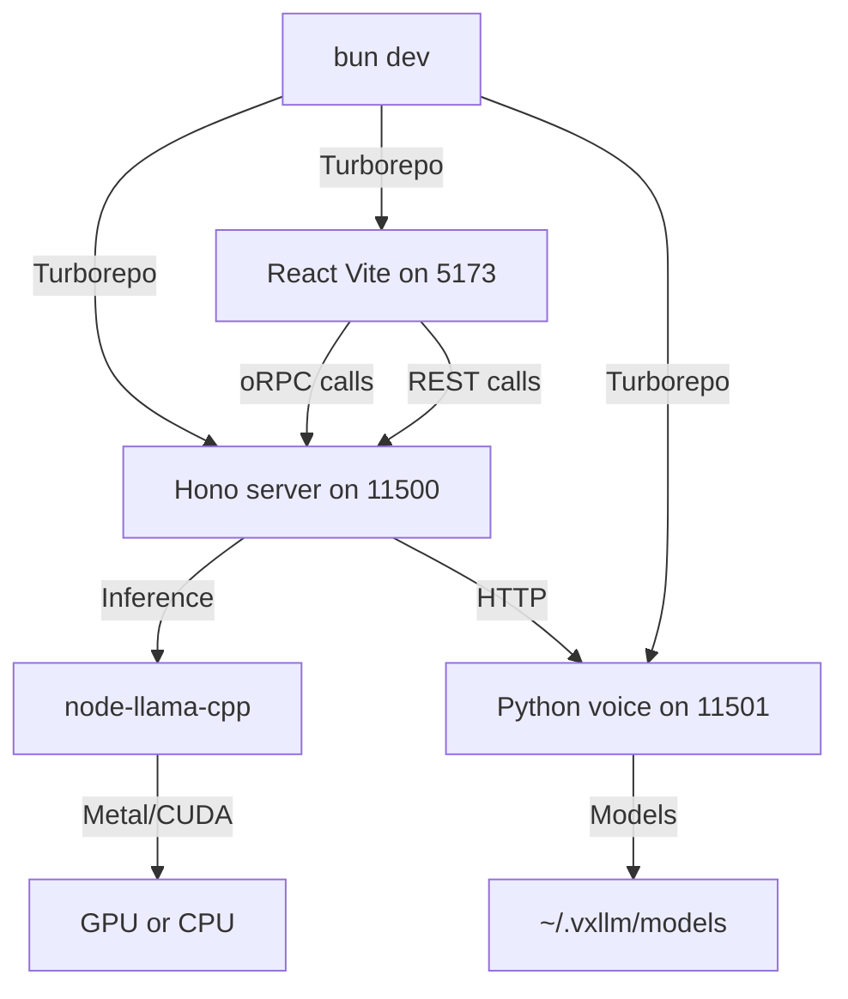

# Tech Stack

VxLLM is built on a modern, type-safe stack optimized for fast local AI inference with voice capabilities. This document describes all core technologies, their versions, purposes, and selection rationale.

## Runtime & Package Management

### Bun

**Version:** Latest
**Category:** Runtime & Package Manager
**Purpose:** Unified JavaScript/TypeScript runtime and package manager for the entire monorepo

**Why Chosen:**
- Single fast runtime eliminates Node.js/npm friction
- Native TypeScript support (no compilation step needed)
- Built-in workspace support for monorepos
- Superior performance over Node.js/npm for cold starts
- Integrated fetch, file I/O, and process management
- Modern defaults align with project goals

**Key Features Used:**
- `bun dev` for development
- `bun build` for production builds
- Workspace-aware `bun install`
- Native HTTP server capabilities
- Process spawning for voice sidecar management

---

## Server Framework

### Hono

**Version:** Latest
**Category:** Web Framework
**Purpose:** Lightweight, edge-optimized REST API server for LLM inference and OpenAI compatibility layer

**Why Chosen:**
- Minimal footprint (perfect for embedding in Electron/Tauri apps)
- Works on any JavaScript runtime (Bun, Cloudflare Workers, etc.)
- Type-safe middleware and routing
- Excellent performance in benchmarks
- Integrates seamlessly with oRPC
- Zero dependencies for core features

**Key Features Used:**
- Raw Hono routes for OpenAI proxy endpoints (`/v1/chat/completions`, `/v1/models`, etc.)
- Middleware for CORS, logging, error handling
- Request/response streaming support
- Built-in status code utilities

**Port:** 11500 (configurable via `PORT` env var)

---

## LLM Inference

### node-llama-cpp v3

**Version:** v3
**Category:** Core Inference Engine
**Purpose:** In-process GGUF model inference with auto-detection of hardware acceleration (Metal/CUDA/CPU)

**Why Chosen:**
- **In-process:** Zero latency, no subprocess overhead, easier state management
- **Hardware auto-detection:** Automatically uses Metal (Apple Silicon), CUDA (NVIDIA), or SSE (CPU fallback)
- **GGUF support:** Access to thousands of quantized models from Hugging Face
- **Quantization awareness:** Respects Q4_K_M, Q5_K_M, Q8_0 and other quant formats
- **KV cache control:** Fine-tune VRAM usage via GPU layers override
- **C++ bindings:** Better performance than pure JavaScript
- **Active maintenance:** Regular updates for new model formats

**Configuration:**
- `GPU_LAYERS_OVERRIDE`: Optional manual control of layer offloading
- Auto-detects available VRAM and model size
- Fallback to CPU if GPU memory insufficient

**Limitations by Design:**
- No MLX support (node-llama-cpp's Metal backend is superior)
- Single model in-flight at a time (acceptable for MVP)

---

## AI SDK & Streaming

### Vercel AI SDK (ai) + ai-sdk-llama-cpp

**Version:** Latest
**Category:** Streaming & Generation Interface
**Purpose:** Unified streaming interface for text generation, object generation, and chat completions

**Core Package:** `ai`
- Provides `streamText()` for streaming responses
- Provides `generateObject()` for structured outputs (JSON)
- Language-agnostic provider pattern

**Custom Provider:** Fresh AI SDK adapter built on node-llama-cpp (`packages/llama-provider`)
- Purpose-built AI SDK provider interface for node-llama-cpp (not a fork of ai-sdk-llama-cpp)
- Enables `streamText` and `generateObject` over local models
- Handles token streaming and cost estimation
- Type-safe prompt/completion definitions

**Why Chosen:**
- Unified API across multiple providers (OpenAI, local, Anthropic, etc.)
- Built-in streaming support with proper error handling
- Type-safe generation with Zod schemas
- React hooks integration via `@ai-sdk/react`
- Industry-standard pattern

**Key Features Used:**
- `streamText()`: Streaming text generation for chat
- `generateObject()`: Structured outputs (model selection, settings generation)
- `useChat()`: React hook for managing conversation state
- `useCompletion()`: React hook for non-chat completion flows

---

## API Layer

### oRPC (Object RPC)

**Version:** Latest
**Category:** App Routes & Type Safety
**Purpose:** Type-safe, end-to-end typesafe RPC router for internal app procedures (chat, model management, settings)

**Location:** `packages/api`

**Why Chosen:**
- Full TypeScript support with zero serialization overhead in development
- Automatic type inference on client side
- Zod validation integration
- Lightweight (no HTTP overhead for internal calls in Tauri)
- React Query (TanStack Query) integration built-in
- Clear separation of concerns: oRPC for domain logic, Hono for OpenAI compatibility

**Defined Procedures:**
- Chat procedures (createMessage, listMessages, deleteConversation)
- Model management (listModels, setDefaultModel, downloadModel)
- Settings management (updateSettings, getSettings)
- System status (getSystemInfo, getResourceUsage)

**Validation:** All inputs validated with Zod before execution

### Raw Hono Routes (OpenAI Compatibility)

**Category:** External API Gateway
**Purpose:** OpenAI-compatible REST endpoints for third-party integrations and external clients

**Why Raw Hono Instead of oRPC:**
- oRPC is JavaScript/TypeScript only; OpenAI clients are polyglot
- HTTP is required for browser-based integrations
- Standard REST pattern expected by external tools
- Can be proxy-forwarded to remote servers

**Endpoints Implemented:**
- `GET /v1/models` → List available models
- `POST /v1/chat/completions` → Stream or non-streaming chat
- `POST /v1/completions` → Legacy completion endpoint
- `GET /v1/health` → Server health check

---

## Database

### Drizzle ORM

**Version:** Latest
**Category:** Database ORM & Schema Management
**Purpose:** Type-safe database access with zero-runtime overhead

**Why Chosen:**
- Type-safe SQL queries (catches errors at build time)
- Excellent TypeScript support
- Lightweight (no runtime magic)
- Migrations built into development flow
- Works seamlessly with Turso/libSQL

**Location:** `packages/db`

**Key Features Used:**
- Relation definitions (foreign keys, one-to-many)
- Migrations with `drizzle-kit`
- Schema generation from TypeScript definitions

### SQLite (libSQL/Turso)

**Version:** Latest
**Category:** Database Engine
**Purpose:** Embedded relational database for models, conversations, settings, usage metrics

**Why Chosen:**
- No external database dependency (easier deployment)
- Excellent performance for local workloads
- Proven reliability
- Turso option for cloud backups (future consideration)
- Lightweight (perfect for desktop/embedded scenarios)
- Full ACID compliance

**Storage Location:** `~/.vxllm/database.db` (configurable via `DATABASE_URL`)

**Schema:**
- `models` → Downloaded/available models with metadata
- `conversations` → Chat sessions
- `messages` → Individual messages within conversations
- `settings` → User preferences (theme, default model, etc.)
- `api_keys` → API keys for server mode authentication
- `usage_metrics` → Token counts, inference times
- `voice_profiles` → TTS voice settings per conversation
- `tags` → Reusable tags for organization
- `model_tags` → Model-tag relationships
- `download_queue` → Pending/in-progress model downloads

---

## Frontend

### React 19

**Version:** 19
**Category:** UI Library
**Purpose:** Modern component-based UI rendering with server-component support

**Why Chosen:**
- Latest stable release with improved performance
- Server Component support (future optimization)
- Improved hooks system
- Acts both in-browser and in Tauri webview
- Largest ecosystem of libraries

### Vite

**Version:** Latest
**Category:** Build Tool
**Purpose:** Fast development server and production bundler

**Why Chosen:**
- Lightning-fast HMR (hot module replacement)
- Minimal configuration
- Excellent plugin ecosystem
- Works perfectly with Tauri
- Fast production builds with rollup

### TanStack Router

**Version:** Latest
**Category:** File-Based Routing
**Purpose:** Type-safe, file-based routing for React SPA

**Location:** `apps/app/src/routes`

**Why Chosen:**
- Automatic route inference from filesystem
- Type-safe route parameters and search params
- Excellent TypeScript support
- Lazy code splitting out of the box
- Modern alternative to React Router v6

**Route Structure:**
- `/` → Dashboard
- `/chat` → Chat interface
- `/models` → Model management
- `/settings` → User preferences
- `/download` → Model download progress

### Tailwind CSS v4

**Version:** 4
**Category:** Utility-First CSS
**Purpose:** Rapid styling with constraint-based design system

**Why Chosen:**
- v4 brings native CSS variables (dynamic theming)
- JIT compilation for minimal CSS output
- Excellent dark mode support
- Mobile-first responsive design
- Huge ecosystem of plugins
- Performance optimized

**Configuration:** `apps/app/tailwind.config.ts`

**Dark Mode:** Integrated via `next-themes` package

### shadcn/ui

**Version:** Latest
**Category:** Headless UI Components
**Purpose:** Reusable, accessible, styled React components

**Why Chosen:**
- Built on Radix UI (fully accessible)
- Copy-paste pattern (not a dependency, you own the code)
- Beautiful defaults with Tailwind
- Extensive component library
- Perfect for rapid UI development

**Location:** `packages/ui/src/components`

**Components Used:**
- Button, Card, Dialog, Dropdown
- Input, Select, Textarea
- Tabs, Accordion
- Badge, Progress
- Tooltip, Popover
- Sheet (sidebar)
- Scroll Area
- Alert, Toast

### Lucide React

**Version:** Latest
**Category:** Icon Library
**Purpose:** Consistent, scalable SVG icons throughout the UI

**Why Chosen:**
- Tree-shakeable (unused icons not bundled)
- Beautiful, consistent design
- Customizable (size, stroke, color)
- No font files needed

---

## State Management

### Zustand (Client-Side)

**Version:** Latest
**Category:** Client State Management
**Purpose:** Lightweight state management for UI state (settings, active model, audio playback)

**Why Chosen:**
- Tiny bundle size
- Simple API (no boilerplate)
- DevTools integration
- Works great with async/thunks
- Excellent TypeScript support

**Stores Defined:**
- `useSettingsStore` → User preferences (theme, API endpoint, TTS voice)
- `useAudioStore` → Audio playback state (isRecording, audioLevel)
- `useModelStore` → Active model, available models
- `useUIStore` → Open dialogs, sidebar state

### TanStack Query (Server State)

**Version:** Latest (v5 or later)
**Category:** Server State Management & Fetching
**Purpose:** Manage asynchronous server state (conversations, messages, models from API)

**Why Chosen:**
- Automatic caching and stale-time management
- Background refetching
- Optimistic updates
- Excellent error handling
- Built-in pagination support
- React hooks first

**Integration with oRPC:**
- Custom hooks wrap query calls to API procedures
- Type-safe query keys
- Automatic invalidation on mutations

---

## Chat & Markdown

### @ai-sdk/react

**Version:** Latest
**Category:** Chat & Streaming Hooks
**Purpose:** React hooks for managing chat state and streaming responses

**Hooks Used:**
- `useChat()` → Multi-turn conversation management
- `useCompletion()` → Single completion without history

**Features:**
- Automatic message append/removal
- Streaming response handling
- Error state management
- Input handling

### react-markdown

**Version:** Latest
**Category:** Markdown Rendering
**Purpose:** Render Markdown message content in chat UI

**Why Chosen:**
- Safe HTML escaping by default
- Plugin support for custom renderers
- Performance optimized

**Integrated With:** Shiki for syntax highlighting

### Shiki

**Version:** Latest
**Category:** Syntax Highlighting
**Purpose:** Beautiful code block highlighting in Markdown

**Why Chosen:**
- VSCode-quality highlighting
- Tiny bundle with async loading
- Theme support (light/dark)

---

## Data Visualization

### recharts

**Version:** Latest
**Category:** Charts & Graphs
**Purpose:** Display usage metrics, token counts, inference times on dashboard

**Why Chosen:**
- React component-based (no canvas hassle)
- Responsive by default
- Good performance
- Extensive chart types
- TypeScript support

**Charts Used:**
- LineChart for token usage over time
- BarChart for model usage comparison
- AreaChart for inference latency trends
- PieChart for VRAM allocation

---

## Desktop Application

### Tauri 2

**Version:** 2
**Category:** Desktop Framework
**Purpose:** Cross-platform desktop wrapper for React app with system integration (process management, tray, native menus)

**Why Chosen:**
- Lightweight Rust backend (vs. Electron)
- Small bundle size (~50MB vs. 200MB+)
- Native system integration (tray, file dialogs)
- Security model (granular permissions)
- Excellent TypeScript integration via `@tauri-apps/api`

**Architecture:**
- Frontend: React+Vite (unchanged from web version)
- Backend: Rust (in `apps/app/src-tauri`)
- IPC: JSON-based command system

**Key Responsibilities:**
- Spawn/manage Hono server process at startup
- Detect server health and auto-restart on crash
- System tray integration (show/hide window)
- File dialogs for model downloads
- Check for app updates

**Conditional Code:** UI checks `__TAURI__.tauri` to enable desktop-only features (file access, tray menu)

**Build:**
- `bun tauri build` for production (creates .dmg, .msi, .AppImage)
- `bun tauri dev` for live testing with hot reload

---

## Command-Line Interface

### citty

**Version:** Latest
**Category:** CLI Framework
**Purpose:** Unified command-line interface for model management and server control

**Why Chosen:**
- Minimal, modern CLI framework from UnJS
- Excellent TypeScript support
- Pretty output with colors/tables
- Easy argument parsing

**Location:** `apps/cli`

**Commands Implemented:**
- `vxllm serve` → Start server (or attach to existing)
- `vxllm pull <model>` → Download model from registry
- `vxllm run <model> <prompt>` → Single inference
- `vxllm list` → Show available models
- `vxllm ps` → Show running instances
- `vxllm rm <model>` → Delete downloaded model

---

## Model Management

### @huggingface/hub

**Version:** Latest
**Category:** Model Registry Integration
**Purpose:** Download quantized models from Hugging Face Hub

**Why Chosen:**
- Official SDK from Hugging Face
- Resume support for large downloads
- Authentication support (for private models)
- Progress streaming

**Integration:** Wrapped in `packages/inference/download.ts`

### Bun Native Fetch

**Version:** Built-in
**Category:** HTTP Client
**Purpose:** Download models and check for updates

**Why Chosen:**
- Already available in Bun runtime
- Supports streaming (perfect for progress tracking)
- Simpler than axios for this use case

**ReadableStream Support:** Model downloads show real-time progress via streams

---

## Voice Support

### faster-whisper (Python)

**Version:** Latest
**Category:** Speech-to-Text (STT)
**Purpose:** Convert user voice input to text with high accuracy and speed

**Why Chosen:**
- 4x faster than official Whisper
- Uses ONNX Runtime (optimized)
- Runs on CPU or GPU
- Multi-language support
- Small model sizes available

**Model:** Base model by default (reasonable accuracy/speed tradeoff)

### Kokoro-82M (Python)

**Version:** Latest
**Category:** Text-to-Speech (TTS)
**Purpose:** Convert model responses to natural-sounding speech

**Why Chosen:**
- Lightweight (82M parameters, fits on any hardware)
- High-quality speech synthesis
- Multiple voice options
- Fast inference
- Open-source

**Features:**
- Streaming audio output
- Speed/pitch control
- Multiple languages (future)

### silero-vad (Python)

**Version:** Latest
**Category:** Voice Activity Detection (VAD)
**Purpose:** Detect when user stops speaking (silence detection)

**Why Chosen:**
- Tiny model (1MB)
- Real-time performance
- No external dependencies
- High accuracy
- Works on CPU

**Integration:** Runs in voice sidecar, signals end-of-speech to frontend

### FastAPI + Uvicorn (Python Voice Sidecar)

**Version:** Latest
**Category:** Voice Processing Server
**Purpose:** Isolated Python service for STT/TTS/VAD processing

**Location:** `sidecar/voice`

**Why FastAPI:**
- Type-safe with Pydantic
- Built-in OpenAPI docs
- Excellent performance
- Perfect for microservice pattern

**Code Size:** ~150 lines

**Port:** 11501 (configurable via `VOICE_SIDECAR_URL`)

**Endpoints:**
- `POST /transcribe` → Speech to text
- `POST /synthesize` → Text to speech
- `POST /vad` → Voice activity detection
- `GET /health` → Health check

**Communication:** JSON over HTTP (could upgrade to WebSocket for streaming in future)

---

## Configuration Management

### @t3-oss/env-core + Zod

**Version:** Latest
**Category:** Environment Variable Validation
**Purpose:** Type-safe, validated environment configuration

**Why Chosen:**
- Validates env vars at startup (fail fast)
- Full TypeScript inference
- Clear documentation of required vars
- Zod error messages are excellent
- Zero runtime overhead

**Location:** `packages/env/index.ts`

**Validated Environment Variables:**

| Variable | Required | Default | Description |
|----------|----------|---------|-------------|
| `DATABASE_URL` | No | `sqlite://~/.vxllm/database.db` | SQLite database connection string |
| `PORT` | No | `11500` | Server port (HTTP) |
| `HOST` | No | `127.0.0.1` | Server bind address (127.0.0.1 for localhost, 0.0.0.0 for network) |
| `MODELS_DIR` | No | `~/.vxllm/models` | Directory for downloaded GGUF models |
| `VOICE_SIDECAR_URL` | No | `http://localhost:11501` | Python voice sidecar address |
| `API_KEY` | No | None | Required if `HOST` is not 127.0.0.1 (server mode) |
| `LOG_LEVEL` | No | `info` | Logging verbosity (debug, info, warn, error) |
| `DEFAULT_MODEL` | No | `mistral-7b-v0.3` | Model to load at startup |
| `CORS_ORIGINS` | No | `http://localhost:5173,http://localhost:1430` | CORS-allowed origins (comma-separated) |
| `MAX_CONTEXT_SIZE` | No | `2048` | Maximum tokens in context window |
| `GPU_LAYERS_OVERRIDE` | No | None | Force specific GPU layer offload count (for tuning) |

---

## Development Tools & Scripts

### Turborepo

**Version:** Latest
**Category:** Monorepo Task Runner
**Purpose:** Efficient, cached task execution across all packages

**Why Chosen:**
- Intelligent caching (avoids redundant builds)
- Parallel execution
- Excellent for monorepos
- Works seamlessly with Bun
- Clear task dependencies

**Key Scripts:**

```bash
turbo build          # Build all packages
turbo dev            # Start all dev servers
turbo lint           # Lint all packages
turbo test           # Run tests
turbo db:generate    # Generate Drizzle types
turbo db:migrate     # Run migrations
```

### Development Server Commands

```bash
# Full stack development
bun dev

# Build for production
bun build

# Database operations
bun db:generate      # Regenerate Drizzle schema types
bun db:migrate       # Apply pending migrations
bun db:push          # Sync schema to database

# Desktop development
bun tauri dev        # Tauri dev server with hot reload
bun tauri build      # Production desktop builds

# CLI
bun cli serve        # Run CLI server command
```

### Code Quality

```bash
bun lint             # ESLint (all packages)
bun format           # Prettier formatting
bun type-check       # TypeScript full check
```

---

## DevOps & Containerization

### Docker & Docker Compose

**Version:** Latest
**Category:** Containerization
**Purpose:** Reproducible deployment across environments

**Configuration Location:** `docker/docker-compose.yml`

**Services:**
- `server` → Hono + node-llama-cpp (separate Dockerfile)
- `voice` → FastAPI + whisper + kokoro (separate Dockerfile)

**Why Docker Compose:**
- Single command to start full stack
- Volume mounts for model sharing
- Network isolation
- Easy scaling (e.g., multiple voice sidecars)

**Build:**
```bash
docker compose build
docker compose up
```

---

## Monorepo Structure

```
vxllm/
├── apps/
│   ├── app/                    # React + Vite + TanStack Router (desktop + web UI)
│   │   ├── src/
│   │   │   ├── routes/         # File-based routing
│   │   │   ├── components/     # React components
│   │   │   ├── hooks/          # Custom React hooks
│   │   │   ├── stores/         # Zustand stores
│   │   │   ├── lib/            # Utilities
│   │   │   └── App.tsx         # Root component
│   │   ├── src-tauri/          # Rust backend (Tauri)
│   │   │   └── src/
│   │   │       ├── main.rs     # App entry point
│   │   │       └── system.rs   # Process management
│   │   ├── vite.config.ts      # Vite configuration
│   │   ├── tauri.conf.json     # Tauri config
│   │   └── package.json
│   │
│   ├── server/                 # Hono + node-llama-cpp
│   │   ├── src/
│   │   │   ├── index.ts        # Server entry point
│   │   │   ├── routers/        # Hono route handlers
│   │   │   │   ├── openai.ts   # /v1/* endpoints
│   │   │   │   └── status.ts   # Health checks
│   │   │   └── middleware.ts   # CORS, logging, etc.
│   │   ├── bun.ts             # Bun runtime config
│   │   └── package.json
│   │
│   ├── cli/                    # citty CLI
│   │   ├── src/
│   │   │   ├── index.ts        # CLI entry point
│   │   │   └── commands/       # Command definitions
│   │   │       ├── serve.ts
│   │   │       ├── pull.ts
│   │   │       ├── run.ts
│   │   │       └── list.ts
│   │   └── package.json
│   │
│   ├── docs/                   # Documentation site (Fumadocs, Next.js)
│   │   ├── app/
│   │   ├── content/            # Markdown docs
│   │   └── package.json
│   │
│   └── www/                    # Marketing website (Next.js)
│       └── package.json
│
├── packages/
│   ├── inference/              # node-llama-cpp wrapper
│   │   ├── src/
│   │   │   ├── index.ts        # Main export
│   │   │   ├── llama.ts        # Model loading/inference
│   │   │   ├── hardware.ts     # GPU detection (Metal/CUDA)
│   │   │   └── download.ts     # Model downloads
│   │   └── package.json
│   │
│   ├── llama-provider/         # AI SDK provider (fresh adapter)
│   │   ├── src/
│   │   │   ├── index.ts
│   │   │   ├── stream.ts       # Streaming implementation
│   │   │   └── utils.ts
│   │   └── package.json
│   │
│   ├── api/                    # oRPC router definitions
│   │   ├── src/
│   │   │   ├── index.ts        # Router export
│   │   │   ├── procedures/
│   │   │   │   ├── chat.ts
│   │   │   │   ├── models.ts
│   │   │   │   ├── settings.ts
│   │   │   │   └── system.ts
│   │   │   └── context.ts      # oRPC context type
│   │   └── package.json
│   │
│   ├── db/                     # Drizzle ORM + schema
│   │   ├── src/
│   │   │   ├── index.ts        # Schema export
│   │   │   ├── schema/
│   │   │   │   ├── models.ts
│   │   │   │   ├── conversations.ts
│   │   │   │   ├── messages.ts
│   │   │   │   ├── settings.ts
│   │   │   │   ├── api-keys.ts
│   │   │   │   ├── usage-metrics.ts
│   │   │   │   ├── voice-profiles.ts
│   │   │   │   └── tags.ts
│   │   │   └── client.ts       # Drizzle client
│   │   ├── drizzle/            # Migrations
│   │   └── package.json
│   │
│   ├── ui/                     # shadcn/ui components
│   │   ├── src/
│   │   │   ├── components/     # Radix UI + Tailwind
│   │   │   │   ├── button.tsx
│   │   │   │   ├── card.tsx
│   │   │   │   ├── dialog.tsx
│   │   │   │   ├── select.tsx
│   │   │   │   └── ... more
│   │   │   └── index.ts
│   │   └── package.json
│   │
│   ├── env/                    # t3-env configuration
│   │   ├── src/
│   │   │   └── index.ts        # Env schema & validation
│   │   └── package.json
│   │
│   └── config/                 # Shared TypeScript config
│       ├── eslint.config.ts
│       ├── tsconfig.base.json
│       └── package.json
│
├── sidecar/
│   └── voice/                  # Python FastAPI voice service
│       ├── main.py             # FastAPI app
│       ├── transcribe.py       # faster-whisper integration
│       ├── synthesize.py       # Kokoro TTS integration
│       ├── vad.py              # silero-vad integration
│       ├── requirements.txt
│       └── Dockerfile
│
├── docker/
│   ├── Dockerfile.server       # Hono server container
│   ├── Dockerfile.voice        # Python voice sidecar container
│   └── docker-compose.yml
│
├── models.json                 # Curated model registry
├── turbo.json                  # Turborepo config
├── bun.lockb                   # Bun lockfile
├── tsconfig.json               # Root TypeScript config
└── README.md
```

---

## Package Responsibilities

### `packages/inference`
Handles all LLM operations:
- Model loading via node-llama-cpp
- Hardware auto-detection (Metal/CUDA/CPU)
- Download progress tracking
- VRAM management
- Context window calculation
- Quantization format validation

### `packages/llama-provider`
Implements AI SDK provider:
- Streaming response handling
- Token counting
- Cost estimation
- Prompt/completion templates
- Error handling and retries

### `packages/api`
Type-safe RPC routes:
- Chat (create, delete, list)
- Model management (list, set, download, delete)
- Settings CRUD
- System information
- Resource monitoring

### `packages/db`
Database layer:
- Schema definitions via Drizzle
- Migration management
- Type-safe queries
- Relation setup
- Database client factory

### `packages/ui`
Reusable components:
- All shadcn/ui components (copied, not imported)
- Custom component wrappers
- Accessibility features
- Tailwind + dark mode integration

### `packages/env`
Environment configuration:
- t3-env schema validation
- Type inference for `process.env`
- Documentation of all variables
- Defaults and constraints

### `packages/config`
Shared configurations:
- TypeScript compiler options
- ESLint rules
- Prettier settings
- Shared imports

---

## Version Constraints

All packages use `latest` or caret (`^`) versions to stay current with minor/patch updates:
- Major version bumps require explicit update and testing
- Dependencies are audited monthly for security
- Breaking changes are tracked in CHANGELOG.md

---

## Build & Development Flow



This tech stack balances performance, developer experience, maintainability, and deployment simplicity while enabling full local AI capabilities with voice.
